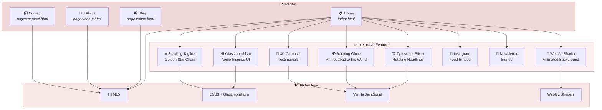

<!-- ╔══════════════════════════════════════════════════════════════════╗ -->
<!-- ║                     RIVAAJE' — રિવાજે'                        ║ -->
<!-- ║             TRADITION, TAILORED, TIMELESSLY                    ║ -->
<!-- ╚══════════════════════════════════════════════════════════════════╝ -->

<p align="center">
  <svg xmlns="http://www.w3.org/2000/svg" viewBox="0 0 800 200" width="800" height="200">
    <defs>
      <linearGradient id="bgGrad" x1="0%" y1="0%" x2="100%" y2="100%">
        <stop offset="0%" style="stop-color:#f0d8d8;stop-opacity:1" />
        <stop offset="50%" style="stop-color:#f8e8e8;stop-opacity:1" />
        <stop offset="100%" style="stop-color:#f0d8d8;stop-opacity:1" />
      </linearGradient>
      <linearGradient id="roseGold" x1="0%" y1="0%" x2="100%" y2="100%">
        <stop offset="0%" style="stop-color:#c48878;stop-opacity:1" />
        <stop offset="50%" style="stop-color:#d4a090;stop-opacity:1" />
        <stop offset="100%" style="stop-color:#c48878;stop-opacity:1" />
      </linearGradient>
      <linearGradient id="lotusGrad" x1="0%" y1="100%" x2="100%" y2="0%">
        <stop offset="0%" style="stop-color:#c48878;stop-opacity:0.8" />
        <stop offset="100%" style="stop-color:#d4a090;stop-opacity:1" />
      </linearGradient>
      <filter id="softGlow">
        <feGaussianBlur stdDeviation="2" result="blur" />
        <feComposite in="SourceGraphic" in2="blur" operator="over" />
      </filter>
    </defs>
    <!-- Background -->
    <rect width="800" height="200" rx="16" ry="16" fill="url(#bgGrad)" />
    <rect width="800" height="200" rx="16" ry="16" fill="none" stroke="url(#roseGold)" stroke-width="2" opacity="0.5" />
    <!-- Decorative corner flourishes -->
    <path d="M 30,30 Q 30,15 45,15 Q 30,15 30,30" stroke="url(#roseGold)" stroke-width="1.5" fill="none" opacity="0.6" />
    <path d="M 770,30 Q 770,15 755,15 Q 770,15 770,30" stroke="url(#roseGold)" stroke-width="1.5" fill="none" opacity="0.6" />
    <path d="M 30,170 Q 30,185 45,185 Q 30,185 30,170" stroke="url(#roseGold)" stroke-width="1.5" fill="none" opacity="0.6" />
    <path d="M 770,170 Q 770,185 755,185 Q 770,185 770,170" stroke="url(#roseGold)" stroke-width="1.5" fill="none" opacity="0.6" />
    <!-- Lotus + Infinity Icon (left side) -->
    <g transform="translate(180, 70)" filter="url(#softGlow)">
      <!-- Infinity loop behind lotus -->
      <path d="M 0,25 C 0,10 15,0 25,12 C 30,18 30,32 25,38 C 15,50 0,40 0,25 Z" fill="none" stroke="url(#roseGold)" stroke-width="1.8" opacity="0.5" />
      <path d="M 50,25 C 50,10 35,0 25,12 C 20,18 20,32 25,38 C 35,50 50,40 50,25 Z" fill="none" stroke="url(#roseGold)" stroke-width="1.8" opacity="0.5" />
      <!-- Lotus petals -->
      <ellipse cx="25" cy="20" rx="6" ry="16" fill="url(#lotusGrad)" opacity="0.7" />
      <ellipse cx="25" cy="20" rx="6" ry="16" fill="url(#lotusGrad)" opacity="0.6" transform="rotate(-30, 25, 20)" />
      <ellipse cx="25" cy="20" rx="6" ry="16" fill="url(#lotusGrad)" opacity="0.6" transform="rotate(30, 25, 20)" />
      <ellipse cx="25" cy="20" rx="5" ry="13" fill="url(#lotusGrad)" opacity="0.5" transform="rotate(-55, 25, 20)" />
      <ellipse cx="25" cy="20" rx="5" ry="13" fill="url(#lotusGrad)" opacity="0.5" transform="rotate(55, 25, 20)" />
      <!-- Lotus center -->
      <circle cx="25" cy="18" r="4" fill="#c48878" opacity="0.9" />
    </g>
    <!-- Brand Name -->
    <text x="400" y="100" font-family="Georgia, 'Times New Roman', serif" font-size="64" font-weight="bold" fill="url(#roseGold)" text-anchor="middle" letter-spacing="8">Rivaaje'</text>
    <!-- Gujarati script -->
    <text x="400" y="128" font-family="'Noto Sans Gujarati', Georgia, serif" font-size="22" fill="#2e1818" text-anchor="middle" opacity="0.7">રિવાજે'</text>
    <!-- Tagline -->
    <text x="400" y="162" font-family="'Helvetica Neue', Arial, sans-serif" font-size="13" fill="#c48878" text-anchor="middle" letter-spacing="6" font-weight="300">TRADITION &nbsp; ✦ &nbsp; TAILORED &nbsp; ✦ &nbsp; TIMELESSLY</text>
    <!-- Thin decorative lines -->
    <line x1="240" y1="138" x2="360" y2="138" stroke="url(#roseGold)" stroke-width="0.5" opacity="0.4" />
    <line x1="440" y1="138" x2="560" y2="138" stroke="url(#roseGold)" stroke-width="0.4" opacity="0.4" />
  </svg>
</p>

<!-- ─────────────────────── BADGES ─────────────────────── -->

<p align="center">
  
  &nbsp;
  
  &nbsp;
  
  &nbsp;
  
  &nbsp;
  
  &nbsp;
  
</p>

---

<br>

## About Rivaaje'

> *Where heritage meets haute couture — every stitch tells a story of timeless Indian craft reimagined for the modern woman.*

**Rivaaje'** (રિવાજે') is a premium fashion brand by **Sejall**, a designer with over **17 years** of experience in the fashion industry. Based in the textile capital of India — **Ahmedabad, Gujarat** — Rivaaje' creates fusion wear that bridges the elegance of traditional Indian craftsmanship with the clean lines of contemporary Western silhouettes.

The brand specializes in **women's wear**, **baby garments**, and **bespoke custom tailoring** — each piece crafted with intention, precision, and soul.

<br>

## રિવાજે' વિશે

> *જ્યાં વારસો ઉચ્ચ ફેશનને મળે છે — દરેક ટાંકો સમયાતીત ભારતીય કારીગરીની કહાની કહે છે, આધુનિક સ્ત્રી માટે ફરીથી કલ્પિત.*

**રિવાજે'** એ ફેશન ઉદ્યોગમાં **૧૭ વર્ષથી વધુ** અનુભવ ધરાવતાં ડિઝાઇનર **સેજલ** દ્વારા સ્થાપિત એક પ્રીમિયમ ફેશન બ્રાન્ડ છે. ભારતની ટેક્સટાઇલ રાજધાની — **અમદાવાદ, ગુજરાત** — માં સ્થિત, રિવાજે' ફ્યુઝન વેર બનાવે છે જે પરંપરાગત ભારતીય કારીગરીની સુંદરતાને સમકાલીન પશ્ચિમી ડિઝાઇનની સ્વચ્છ રેખાઓ સાથે જોડે છે.

બ્રાન્ડ **મહિલાઓના વસ્ત્રો**, **બાળકોના ગારમેન્ટ્સ**, અને **કસ્ટમ ટેલરિંગ** માં વિશેષતા ધરાવે છે — દરેક ટુકડો ઇરાદા, ચોકસાઈ અને આત્માથી ઘડાયેલો.

---

<br>

## Architecture



---

<br>

## Screenshots

> *Screenshots coming soon — the site is as beautiful as the garments.*

| Page | Preview |
|------|---------|
| **Home — Hero Section** | *Glassmorphism hero with WebGL shader background* |
| **Typewriter Effect** | *"Crafted for your wedding day / festive celebrations / Navratri nights..."* |
| **Rotating Globe** | *From Ahmedabad to the World* |
| **3D Testimonial Carousel** | *Circular rotating customer stories* |
| **Shop** | *Curated collection grid* |
| **Mobile View** | *Fully responsive — from phone to projector* |

---

<br>

## Features

| | Feature | Description |
|---|---------|-------------|
| 🎨 | **WebGL Shader Background** | GPU-accelerated animated gradient that flows like silk fabric |
| 🪟 | **Glassmorphism UI** | Apple-inspired frosted glass cards and navigation |
| ⌨️ | **Typewriter Effect** | Rotating headlines — *wedding day, festive celebrations, Navratri nights...* |
| ⭐ | **Scrolling Tagline Chain** | "TRADITION ✦ TAILORED ✦ TIMELESSLY" with golden star separators |
| 🪷 | **Lotus + Infinity Logo** | Custom SVG combining the lotus (purity) and infinity (timelessness) in rose gold |
| 🌍 | **Rotating Dotted Globe** | "From Ahmedabad to the World" — animated global reach visualization |
| 💬 | **3D Testimonial Carousel** | Circular rotating cards with customer stories |
| 📸 | **Instagram Embed** | Live feed integration from @rivaaje |
| 📧 | **Newsletter Signup** | Elegant subscription form with blush-pink styling |
| 📱 | **Fully Responsive** | Seamless experience from mobile phones to projector displays |
| ⚡ | **Blazing Fast** | Zero frameworks — pure vanilla HTML/CSS/JS for maximum performance |

---

<br>

## Color Palette

The Rivaaje' visual identity draws from the warmth of rose petals and the richness of Indian heritage.

<table>
  <tr>
    <td align="center" width="200">
      <br/>
      <strong>Blush Pink</strong><br/>
      <code>#f0d8d8</code><br/>
      <em>Primary Background</em>
    </td>
    <td align="center" width="200">
      <br/>
      <strong>Rose Gold</strong><br/>
      <code>#c48878</code><br/>
      <em>Accent & Logo</em>
    </td>
    <td align="center" width="200">
      <br/>
      <strong>Deep Mahogany</strong><br/>
      <code>#2e1818</code><br/>
      <em>Text & Headings</em>
    </td>
    <td align="center" width="200">
      <br/>
      <strong>Soft Petal</strong><br/>
      <code>#f8e8e8</code><br/>
      <em>Card Backgrounds</em>
    </td>
  </tr>
</table>

---

<br>

## Tech Stack

| Layer | Technology | Purpose |
|-------|-----------|---------|
| **Structure** | HTML5 | Semantic, accessible markup |
| **Styling** | CSS3 | Glassmorphism, animations, responsive grid |
| **Interactivity** | Vanilla JavaScript | Typewriter, globe, carousel, scroll effects |
| **Graphics** | WebGL / GLSL Shaders | Animated silk-like background |
| **Logo** | SVG | Scalable lotus + infinity brand mark |
| **Hosting** | Static Files | Zero build step — deploy anywhere |

---

<br>

## Folder Structure

```
rivaaje-website/
│
├── index.html                  # Home page — hero, features, testimonials, globe
│
├── pages/
│   ├── about.html              # Sejall's story & brand philosophy
│   ├── shop.html               # Product collection & categories
│   └── contact.html            # Get in touch & custom order form
│
├── css/
│   └── style.css               # Complete styling — glassmorphism, responsive, animations
│
├── js/
│   ├── main.js                 # Core initialization & navigation
│   ├── shader-background.js    # WebGL GLSL shader for animated hero background
│   ├── typewriter.js           # Rotating headline typewriter effect
│   ├── globe.js                # Dotted rotating globe — "Ahmedabad to the World"
│   ├── testimonials.js         # 3D circular testimonial carousel
│   └── brand-elements.js       # Scrolling tagline chain & brand animations
│
├── images/                     # Product photos, logo assets, textures
│
└── README.md                   # You are here
```

---

<br>

## Getting Started

### Prerequisites

Just a modern web browser. No Node.js. No npm. No build tools. Pure web.

### Run Locally

```bash
# Clone the repository
git clone https://github.com/your-username/rivaaje-website.git

# Navigate into the project
cd rivaaje-website

# Option 1: Open directly
open index.html            # macOS
xdg-open index.html        # Linux

# Option 2: Local server (recommended for WebGL shaders)
python3 -m http.server 8000
# Then visit http://localhost:8000

# Option 3: VS Code Live Server
# Install the "Live Server" extension and click "Go Live"
```

> **Note:** A local server is recommended because WebGL shaders may require HTTP(S) to load correctly in some browsers.

---

<br>

## Credits

<table>
  <tr>
    <td align="center" width="200">
      <strong>Sejall</strong><br/>
      <em>Founder & Creative Director</em><br/>
      17+ years in fashion design<br/>
      The soul behind every stitch
    </td>
    <td align="center" width="200">
      <strong>Darshan Kumar Joshi</strong><br/>
      <em>Technology</em><br/>
      Website development &<br/>
      technical architecture
    </td>
    <td align="center" width="200">
      <strong>Pritesh</strong><br/>
      <em>Support</em><br/>
      Project coordination &<br/>
      quality assurance
    </td>
    <td align="center" width="200">
      <strong>Krishna AI</strong><br/>
      <em>Design Assistant</em><br/>
      AI-powered design<br/>
      consultation & code generation
    </td>
  </tr>
</table>

---

<br>

## અમારી વાર્તા

<blockquote>

### 🪷 રિવાજે' — પરંપરાથી આધુનિકતા સુધીની સફર

રિવાજે' એ માત્ર એક ફેશન બ્રાન્ડ નથી — એ એક સપનું છે જે અમદાવાદની ગલીઓમાં જન્મ્યું, ભારતીય પરંપરાના રંગોમાં ઉછર્યું, અને આજે વિશ્વ સુધી પહોંચવાની યાત્રા પર છે.

**સેજલ** — એક એવી ડિઝાઇનર જેણે ૧૭ વર્ષથી વધુ સમય સુધી કાપડ, રંગ અને ટાંકાની ભાષા સમજી છે. દરેક લેહેંગામાં લાગણી છે, દરેક સાડીમાં વારસો છે, દરેક ડ્રેસમાં આધુનિકતાની ઝલક છે.

**રિવાજે'** નામ જ કહે છે — *રિવાજ* એટલે પરંપરા, સંસ્કૃતિ, આપણા મૂળ. અને અમે એ મૂળને આજની ડિઝાઇનમાં વણી લઈએ છીએ — ભારતીય વસ્ત્રોને પશ્ચિમી દૃષ્ટિકોણ સાથે, જૂની કારીગરીને નવી શૈલી સાથે.

અમારું લોગો — **કમળ અને અનંત** નું જોડાણ — શુદ્ધતા અને સમયાતીતતાનું પ્રતીક છે. ગુલાબી સોનાનો રંગ ભારતીય સ્ત્રીની ગરિમા અને ગ્રેસનું પ્રતિબિંબ છે.

અમદાવાદથી આખા વિશ્વ સુધી — **રિવાજે'** દરેક સ્ત્રી માટે છે જે પરંપરાને પ્રેમ કરે છે, પણ આધુનિકતાને પણ ગળે લગાવે છે.

*દરેક ટાંકામાં પ્રેમ. દરેક ડિઝાઇનમાં વારસો. દરેક પળમાં રિવાજે'.*

</blockquote>

---

<br>

<p align="center">
  <strong>🪷</strong>
  <br/><br/>
  <strong>TRADITION &nbsp; ✦ &nbsp; TAILORED &nbsp; ✦ &nbsp; TIMELESSLY</strong>
  <br/><br/>
  <em>Crafted with love in Ahmedabad, Gujarat</em>
  <br/>
  <em>અમદાવાદ, ગુજરાતમાં પ્રેમથી ઘડાયેલું</em>
  <br/><br/>
  <sub>Copyright &copy; 2026 Rivaaje' (રિવાજે') — All rights reserved.</sub>
</p>
